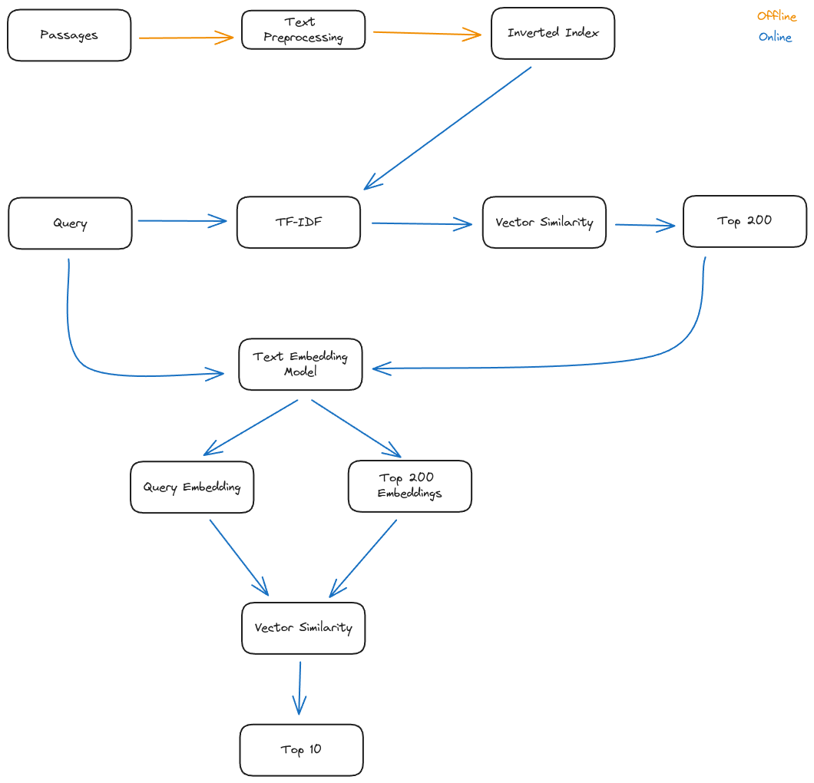

# IRise Retrieval System
<a href="https://github.com/devrimcavusoglu/irise-retrieval-system/blob/main/rsc/final_report.pdf"></a>
<a href="https://github.com/devrimcavusoglu/irise-retrieval-system/blob/main/rsc/poster.pdf"></a>

A simple retrieval system designed as a retrieve-and-rerank methodology. A high-level system overview is provided below.

<center></center>

## Setup

Create a conda environment with the configuration file, and activate the environment when necessary.

```shell
conda env create -f environment.yml
```

activate the environment by
```shell
conda activate irise
```

## Indexing

Index your data by running the command below:

```shell
python -m irise index
```

This will use default variables for indexing path, etc. To see supported and customizable arguments, see

```shell
python -m irise index --help
```

## User Interface
The user interface designed as a web based UI with [streamlit](https://streamlit.io/). Run the following command at the project root.

```shell
streamlit run dashboard/app.py
```

## Development

For convenience add the project root to PYTHONPATH, earlier conda versions support this by `develop` command, run

```shell
conda develop /path/to/project_root
```

However, `conda develop` is deprecated for recent versions, you can manually add the project root to PYTHONPATH by

```shell
export PYTHONPATH="${PYTHONPATH}:/path/to/project_root"
```

Open Pull Request accordingly :).

## License

Copyright © 2024, Devrim Cavusoglu & Ezgi Çavaş.

Licensed under Apache 2.0 License.
